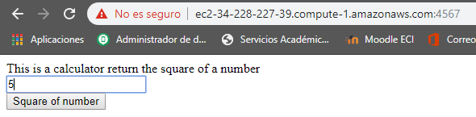
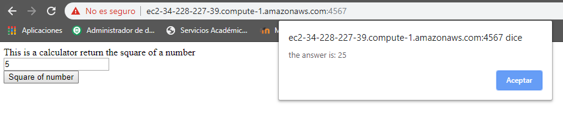
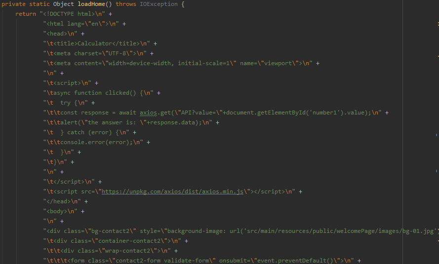
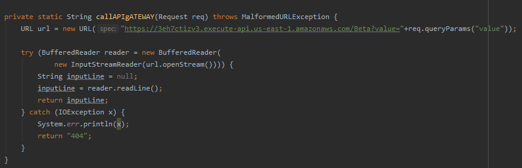

# Amazon Gateway And Lamnbda

### Tests Report
 Web page working on AWS EC2.
 

Html code of Spark web App

Prove that Spark is using lambda service:

## Built With

* [Maven](https://maven.apache.org/) - Dependency Management.
* [AWS](https://aws.amazon.com/es/) - Amazon Web Services to consume the lambda service.

## Authors

* [**Nicolas Garcia Rey**](https://github.com/nicoga97) - *Initial work* 

## License

This project is licensed under the MIT License - see the [LICENSE.md](LICENSE.md) file for details
